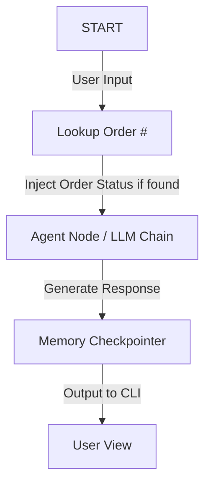

# North-Star-Support-Bot

# 🌟 North Star Support Bot

**North Star Support Bot** is a conversational AI assistant for a mock North American outdoor apparel and camping gear e-commerce store. Powered by **LangChain**, **LangGraph**, and **Google Gemini (`gemini-2.5-flash`)**, the bot leverages graph-based state management and persistent memory to deliver a smart, contextual customer service experience.

---

## 🌲 Features

*   **Order Tracking:** Automatically intercepts messages containing order numbers (e.g., `#111`, `#222`, `#333`) and queries a local database to inject the shipping status directly into the prompt.
*   **Returns & Exchanges:** Explains the store's 30-day return policy and provides a direct returns portal link.
*   **Product Recommendations:** Asks interactive questions to guide users toward the best outdoor categories (Hiking, Camping, Climbing, Apparel, Water Sports).
*   **Shipping Rates:** Fast details on Standard (3-5 business days) vs. Expedited (1-2 business days) shipping options.
*   **Agent Handoff:** Warmly redirects customers to human support (`support@northstar.example.com`) if requested.
*   **Persistent Chat Memory:** Powered by LangGraph's `MemorySaver` to maintain chat thread states across turns, allowing the bot to remember context.

---

## ⚙️ Project Structure

*   `north_star_langchain_bot.py`: The main Python script implementing the state graph, agent definition, and interactive command-line interface (CLI).
*   `requirements.txt`: Specifies library dependencies, including `langchain`, `langgraph`, and `langchain-google-genai`.
*   `.env`: A configuration file for environment secrets (e.g., API keys).

---

## 🚀 Setup & Installation

### 1. Prerequisites
Ensure you have **Python 3.10+** installed on your system.


### 2. Create a Virtual Environment (Recommended)
Set up a clean virtual environment to isolate project packages:
```powershell
# Create environment
python -m venv .venv

# Activate environment (Windows PowerShell)
.\.venv\Scripts\Activate.ps1

# Activate environment (Windows Command Prompt)
.\.venv\Scripts\activate.bat

# Activate environment (macOS/Linux)
source .venv/bin/activate
```

### 3. Install Dependencies
Install all the required Python modules:
```bash
pip install -r requirements.txt
```

---

## 🔑 API Key Configuration

To interact with the Google Gemini model, you need a Google Gemini API Key. 

1. Obtain a free API key from [Google AI Studio](https://aistudio.google.com/).
2. You can configure your key in one of the following ways:
   *   **CLI Prompt:** If no API key is detected in the environment or code, the console will prompt you to paste it when launching.
   *   **Environment Variable:** Set `GOOGLE_API_KEY` on your system.
       ```powershell
       $env:GOOGLE_API_KEY="your_api_key_here"
       ```
   *   **Configuration File (.env):** Save the key in the `.env` file:
       ```env
       GOOGLE_API_KEY="your_api_key_here"
       ```

---

## 💻 Running the Bot

Start the interactive CLI session by running:
```bash
python north_star_langchain_bot.py
```

### In-Chat Commands

*   `reset`: Clears the thread memory and starts a fresh conversation.
*   `quit` or `exit`: Safely closes the session and exits the CLI.

---

## 🛠️ How it Works Under the Hood

### LangGraph State Management
The bot utilizes a custom state graph defined with `StateGraph`:
1.  **State Definition:** A dictionary containing a list of LangChain messages.
2.  **State Node (`agent`):** Invokes the LangChain LLM chain and appends the response.
3.  **Memory Checkpointer:** Utilizes `MemorySaver()` to bind the history to a specific session thread (`user_session_1`).



### Order Lookup Injection
Before sending user queries to the Gemini LLM, a regex pattern detects any numbers with 3 or more digits:
*   If found, the lookup checks a local mock database (`ORDER_DB`):
    *   **`111`**: Shipped — arriving tomorrow 🚚
    *   **`222`**: Processing — ships within 24 hours 📦
    *   **`333`**: Delivered ✅
*   The status is appended to the message context before being processed, allowing the LLM to give accurate, real-time tracking updates.
